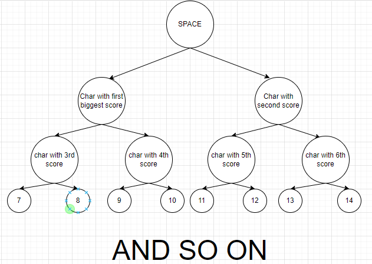
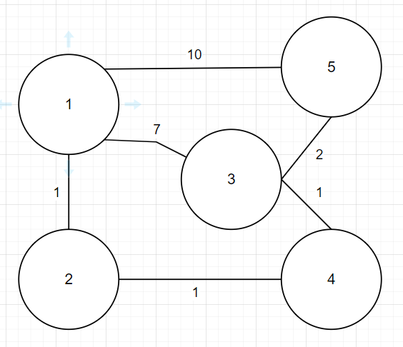

# Comments to the solution

Nice diagrams and examples. Reads almost ok, some minor imprecisions.

# Grade 8.5/10

# Morse code

* For implementation of Morse Code I am using a Binary Tree, later called just BT. The root of the BT is " " but it is used just as a placeholder. In order to complete the BT I am counting the occurrence of each lowercase character and digit in the training test given initially. If there is at least one occurrence, to that number will be added 122, because 122 is the ascii number of "z", else for sorting I use their ascii code. After the counting process comes to an end, I sort the characters by their "score", ascii code  + occurrence count and add " " with the maximum possible value to ensure that it would be the root.

> Alessio: This is hard to follow. Why not simply create a predefined list of allowed chars, order them by frequency and then build the tree with it?

>NOTE: This is what the occurrence count look like for training text "hello world":

[(' ', 9223372036854775929), ('l', 125), ('o', 124), ('d', 123), ('e', 123), ('h', 123), ('r', 123), ('w', 123), ('z', 122), ('y', 121), ('x', 120), ('v', 118), ('u', 117), ('t', 116), ('s', 115), ('q', 113), ('p', 112), ('n', 110), ('m', 109), ('k', 107), ('j', 106), ('i', 105), ('g', 103), ('f', 102), ('c', 99), ('b', 98), ('a', 97), ('9', 57), ('8', 56), ('7', 55), ('6', 54), ('5', 53), ('4', 52), ('3', 51), ('2', 50), ('1', 49), ('0', 48)]

* The second step for creation of Morse Code Tree is inserting into the tree. I am using a special algorithm to insert line by line. The algorithm for it is very easy. We have 2 lists, one is the list of things to insert, second is the possible nodes to insert in. It starts with creating the root and placing it into the nodes to insert in. Create root.left and root.right, place them both into the list to insert in, and delete the root from there. We are inserting the left first, because at left is the more used character rather than the right one. Also at each step left we will add a "." to the output, because the``. '' is lighter than the "-" that goes right.

> Alessio: Not really clear. Why not just do a BST traversal and add the node level by leave? Level 0 - root, level 1 - root.left, root.right, level 2 (4 nodes), etc.?

>NOTE: Take a look at MorseBinaryTreeMiniDemo.png, it is a small demo of how inserting works.

* I am using BT because it perfectly applies to morse code. Characters that are more used are situated higher in the tree and are faster to access.
* Time complexity
* * Average = O(log(n))
* * Worst = O(N)

> Alessio. Ok

## Message Class
* Each message has its sender, receiver, content that is encoded and priority.
* My update is that each message if its broadcast has also a list of persons that already saw it. So when retrieving messages from the queue, the algorithm checks if the person saw the message. If so, the person will not receive the same message twice, otherwise it will see it and be added to the list.

> Alessio: Maintaining a mutable state inside the message (how read it), is overly complex. The easiest solution would have been: 
> - Compute the minimum spanning tree
> - Send a message to all the nodes of the MST (using BFT or DFT)
> - When a message reaches a node, it is COPIED into all the Persons (except for the one who sent it)

# Node And Linked List
## Main data
* Node represents a point that is connected to the overall network. To each node there could be an infinite number of persons connected. A node alone in the network is considered to be a valid network.
* Each node contains 3 pieces of information. First the node id, also the link to the next node, because they are stored in a linked list, and last a queue with all the messages.

> Alessio: Why only a queue and not a queue for each person attached in the node?
 
## Why Linked List?
* Linked list is the easiest data structure to implement, it is also quite efficient, not as efficient as Binary Trees.
* Another reason why i required Linked List is that i require both searching by id and also searching by index.
* Time complexity: O(n)

## Why PriorityQueue?
* By requirements first we should show the oldest message first. That's why we use a queue that has principle of first-in first-out
* Another requirement was to implement that urgent messages are shown before the normal ones. For that i implemented 3 lists for 3 different priorities, and when getting the messages i am merging them together.

> Alessio: So did you implemented a PriorityQueue? How does it work? does it internally use 3 queues/lists of messages?

# Registry
## Data
* In the registry I store the most important data for the whole network, by that I mean connected persons, their serialized keys and the nodes they are connected to.

## AVL
* I opted for AVL Tree as a registry for multiple reasons.

* * First of all, AVL is very efficient, because it is self-balancing.
* * It is height-balanced, so the time complexity is always O(log n)
* * Also it has developed search capabilities because it is a Binary search tree.
* * Moreover, I consider AVL more convenient in this situation rather than Black-Red Trees because in our situation we would look in the tree more often then we insert into it. The balancing advantage that RedBlack possesses is not as valuable.

> Alessio: Splay tree would be also an ideal choice considering the access pattern to the person-related informations

# Communication network

## What data does it contain?
* Creates the link between 2 nodes.
* Check if that link is valid.
> Alessio: The above are not really data... confusing!

## Is_valid
* Checks the validity of the network.
* Uses depth first search. I chose depth first search because I considered that in perspective the network could be very big, deep and wide so usage of the BFS would be less efficient, because more memory could be required.
* The principle of DFS is that the search starts at a random node. The algorithm goes as deep as it can and if it finds unexplored nodes it adds them to the set. In the end the network is valid if all the nodes could be visited.

## Join network/ Leave network
* Join network adds the data about a certain person to the registry
* The leave network is more complex, first you get the node to which the person is connected. Delete all the messages that are directed to the person, then you delete the person from the node and registry.

## Shortest Path
* I use dijkstra for finding the best path because it is the easiest to implement.
* How the Dijkstra algorithm works is that you start with the source node you provide and parse the graph to find the shortest path between that node and all other nodes in the graph. The algorithm tracks the currently known shortest distance from each node to the source node and updates these values ​​when a shorter path is found. When the algorithm finds the shortest path between the source node and another node, that node is marked as "visited" and added to the path. This process continues until all nodes in the diagram have been added to the path. This way you get a path that connects the source node to all other nodes and follows the shortest path to reach each node.
* In order to get the path I get the dictionary with previously visited nodes from the dijkstra and reverse it to get the path. 

> Alessio: How do you use Dijkstra's algorithm? when do you invoke it?

## Send and Broadcast
* I get the receiver and search for the sender node.
* For normal send I also search for the receiver node.
* Then in case for broadcast i iterate through all the nodes, otherwise i just get the receiver node.

> Alessio: How do you iterate over all the nodes?

* Using the dijkstra algorithm I search for the best path.
* If the receiver and sender are on the same node, I just forward to the same node.
* Otherwise I forward to the next node from the path and delete the message from the previous one.

>NOTE: Let's consider our network to be described by this weighted undirected graph.. Let's consider the sender to be on node 1 and receiver on node 5. In this case the path 1->2->4->5 would be the cheapest. The send would work this way. First forward to node 2. Node 2 saves. Node 2 forward to node 4, node 2 delete the message. Node 4 saves. Node 4 forward to node 5, node 4 delete the message. Node 5 saves.

#### Forward
* Just the receiver node saves the message
 
> Alessio: Try to build a MST and send a copy of the message to each sub-tree (recursively). 
